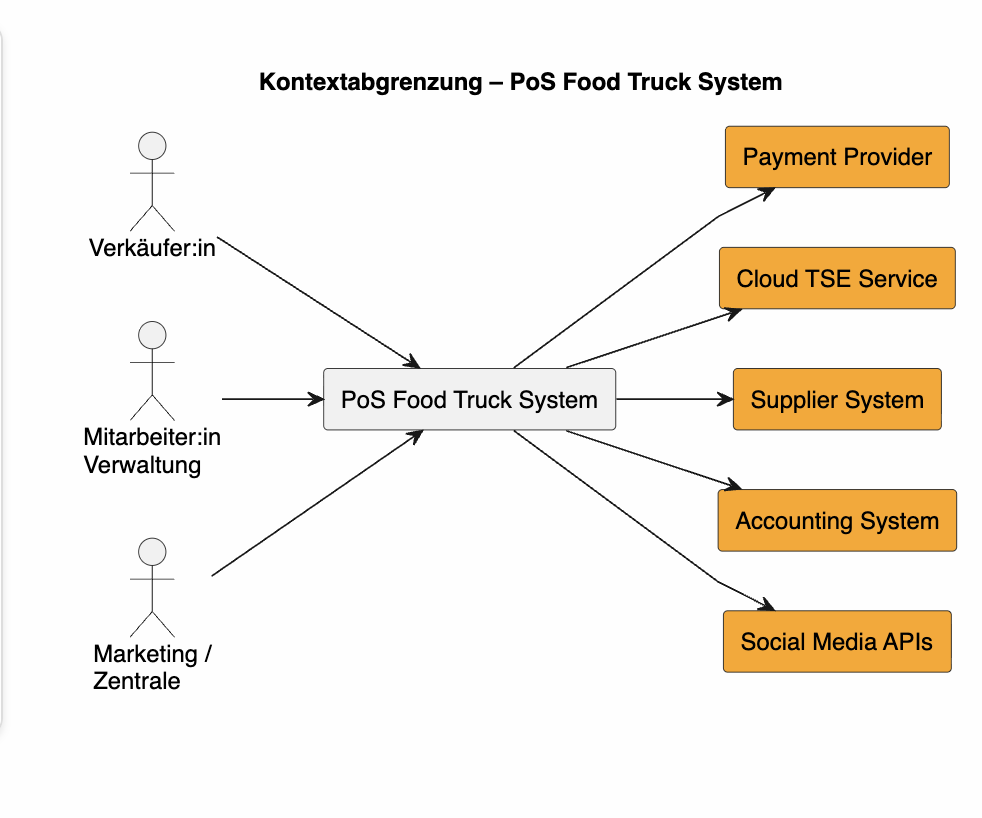
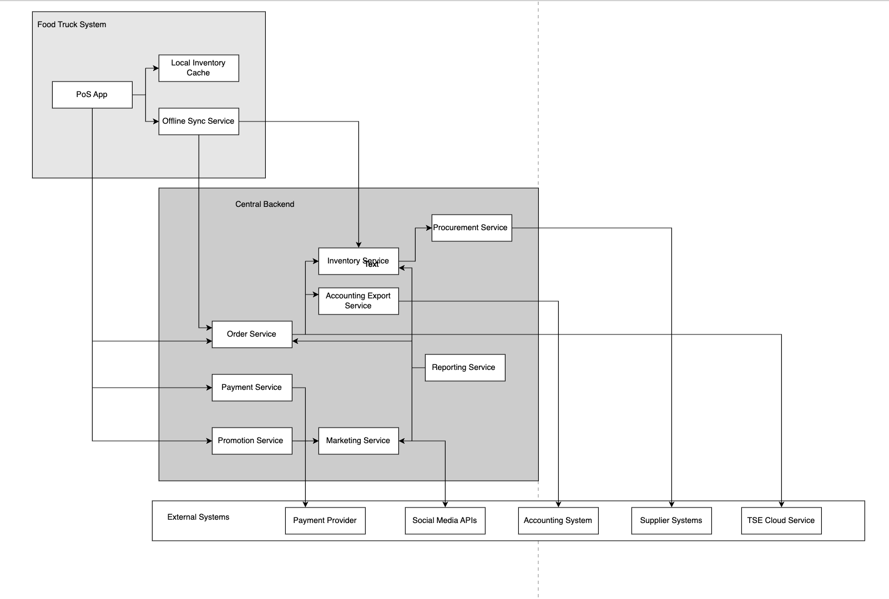
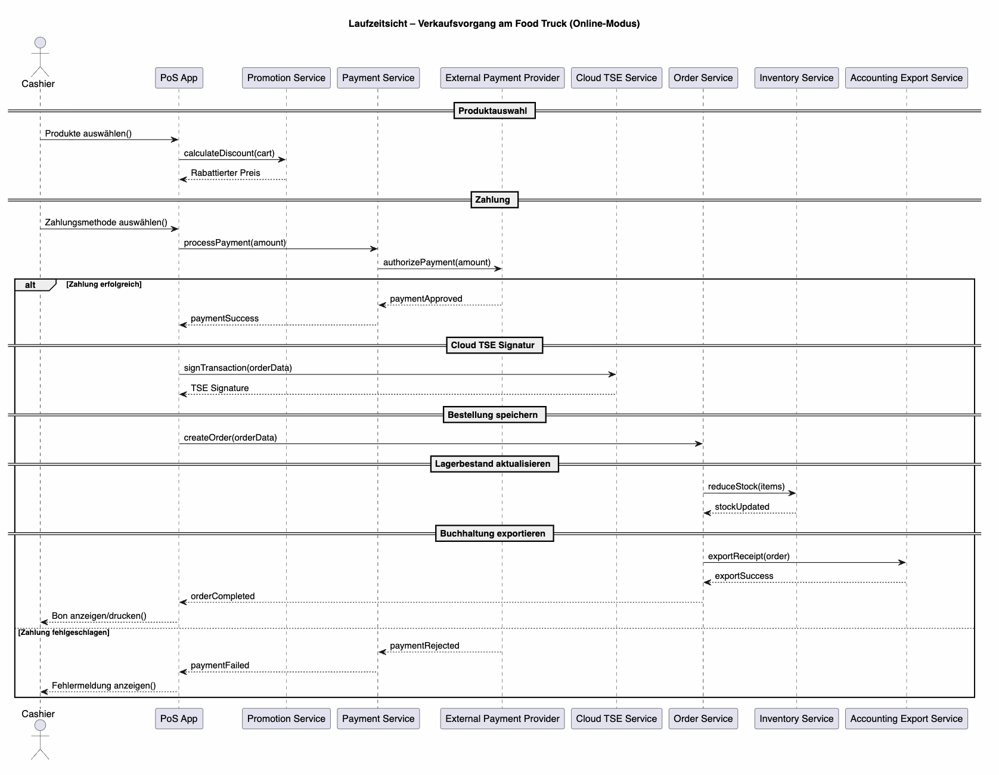
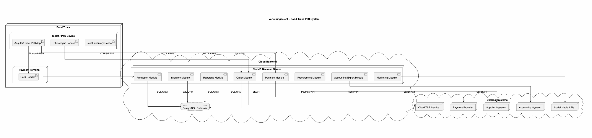
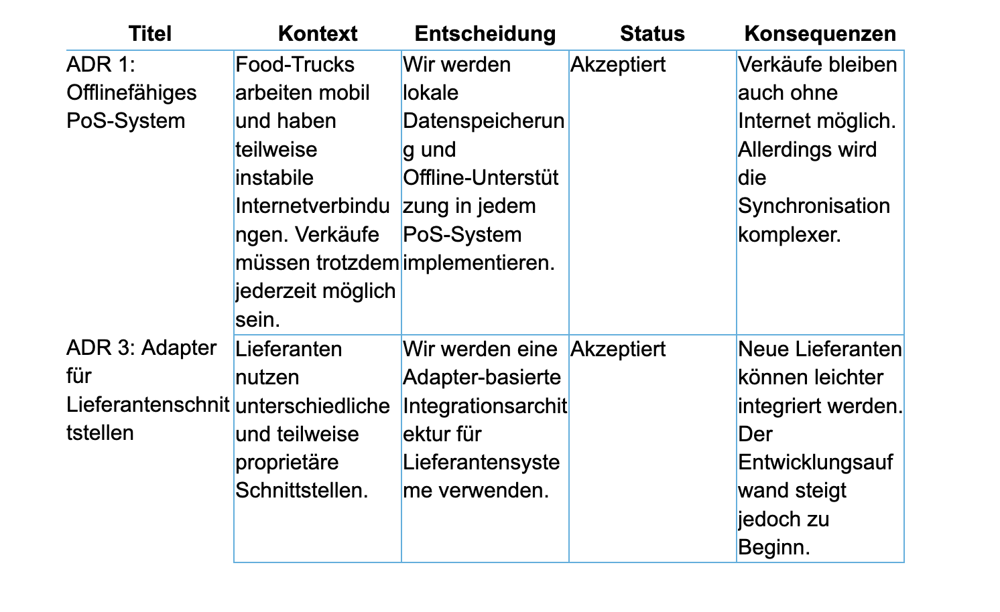
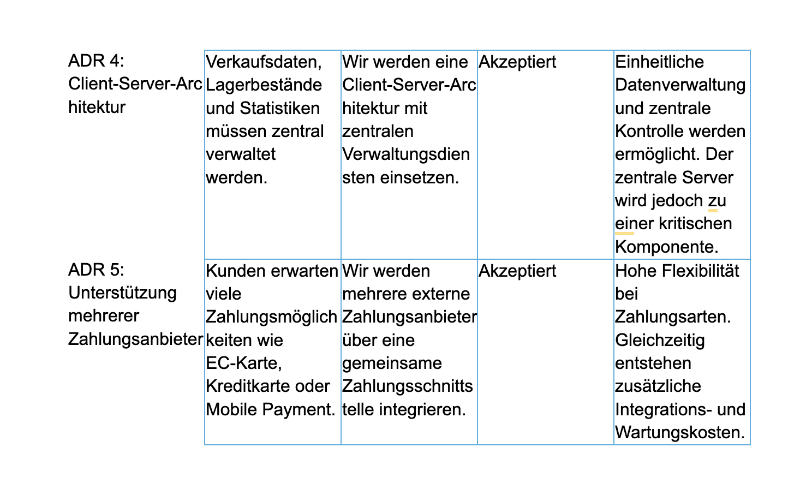
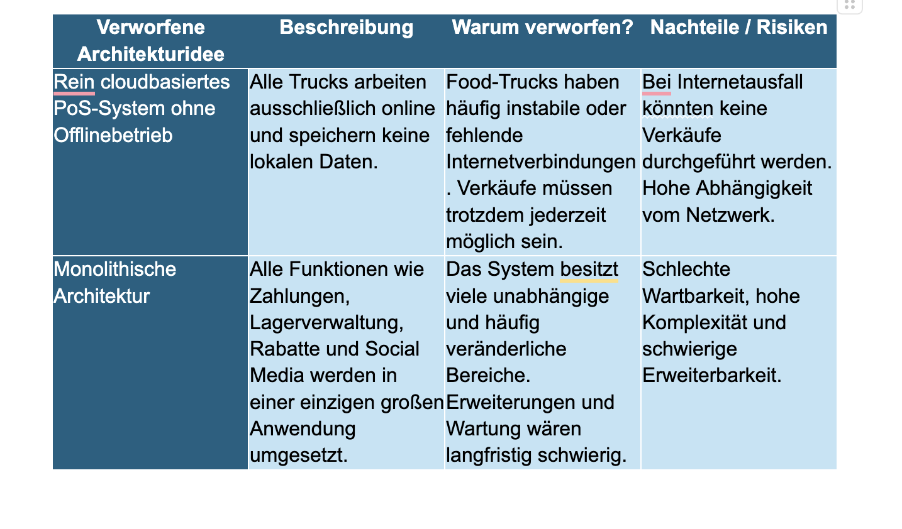
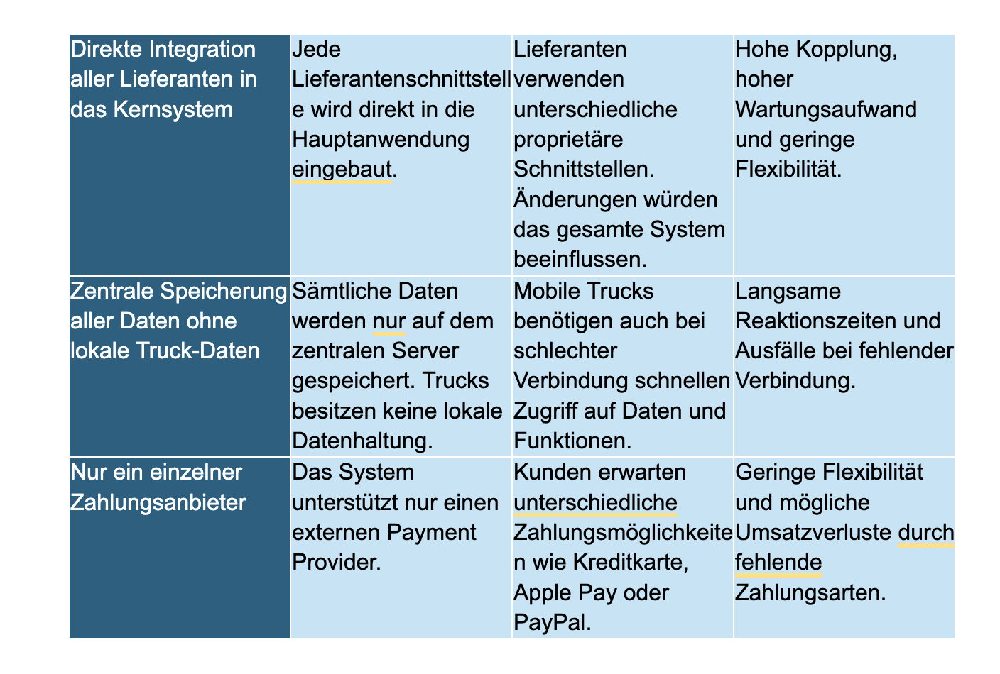

# 1. Einführung und Ziele

## 1.1 Aufgabenstellung

Das Food Truck PoS System ist eine mobile Kassenlösung für den Betrieb mehrerer Food Trucks. Es ermöglicht Verkäufer:innen, Produkte zu erfassen, Zahlungen abzuwickeln und Belege auszustellen, auch ohne Internetverbindung. Eine zentrale Verwaltungseinheit erlaubt es Marketing und Betrieb, Rabattaktionen zu pflegen, Bestände zu verwalten und Verkaufsdaten auszuwerten.

**Wesentliche Use Cases:**

**UC1 Verkauf am Food Truck durchführen:**
Verkäufer:in wählt Produkte aus, das System berechnet Preise und Rabatte automatisch. Der Kunde wählt eine Zahlungsmethode, der Payment Provider bestätigt. Der Vorgang wird mit Zeitstempel, Ort, Truck-ID und Artikeln gespeichert, TSE-konform signiert und ein Bon wird ausgegeben. Verkaufsdaten werden anschließend an die Zentrale synchronisiert.

**UC2 Rabattaktion zentral erstellen und verteilen:**
Marketing erstellt eine Aktion (z. B. „3 für 2"), das System prüft die Regel auf Gültigkeit, speichert und verteilt die Aktion zeitnah an alle betroffenen Trucks. Das PoS wendet die Aktion beim Verkauf automatisch an.

---

## 1.2 Funktionale Anforderungen

### Verkauf und Kasse (PoS)

| ID | Anforderung |
|---|---|
| F1 | Artikel können am PoS erfasst werden (Touchscreen oder Scanner). |
| F2 | Das System berechnet automatisch den Endpreis unter Berücksichtigung aktiver Rabattaktionen. |
| F3 | Verkäufe werden mit Zeitstempel, Ort, Truck-ID und Verkäufer:in gespeichert. |
| F4 | Jeder Verkauf wird TSE-konform signiert. |
| F5 | Belege werden ausgegeben. |
| F6 | Stornos sind möglich. |
| F7 | Verkäufe können auch offline durchgeführt werden. |

---

### Zahlung

| ID | Anforderung |
|---|---|
| F8 | Unterstützung mehrerer Zahlungsarten: EC, Kreditkarte, Apple Pay, Google Pay, PayPal, Bar. |
| F9 | Neue Zahlungsarten können ohne Architekturänderung integriert werden. |

---

### Rabatte und Aktionen

| ID | Anforderung |
|---|---|
| F10 | Rabattaktionen können zentral gepflegt werden. |
| F11 | Unterstützung verschiedener Aktionstypen wie Mengenrabatt, Bundle-Preis, prozentualer Rabatt und Happy Hour. |
| F12 | Aktualisierungen werden zeitnah an alle Trucks verteilt. |

---

### Bestand und Nachschub

| ID | Anforderung |
|---|---|
| F13 | Bestandsänderungen pro Truck werden erfasst. |
| F14 | Das System löst automatisch Nachschub aus der Zentrale aus. |
| F15 | Zentralbestand wird geführt und Nachbestellungen erfolgen automatisch. |
| F16 | Lieferanten-Schnittstellen können über Adapter integriert werden. |

---

### Schnittstellen

| ID | Anforderung |
|---|---|
| F17 | Export von Verkäufen und Rechnungen an bestehende Buchhaltungssysteme. |
| F18 | Integration sozialer Medien für Standort- und Verfügbarkeitsinformationen. |

---

### Verwaltung und Auswertung

| ID | Anforderung |
|---|---|
| F19 | Zentrales Dashboard zur Auswertung von Verkäufen. |

---

## 1.3 Nichtfunktionale Anforderungen (Qualitätsmerkmale)

### Reliability & Availability

| ID | Anforderung |
|---|---|
| NF1 | Verkäufe können bei Verbindungsabbruch lokal gespeichert und später synchronisiert werden. |
| NF2 | Kein Datenverlust bei Verbindungsabbruch. |

---

### Performance Efficiency

| ID | Anforderung |
|---|---|
| NF3 | Das PoS läuft flüssig auf leistungsschwacher Hardware. |
| NF4 | Preisberechnung und Rabattprüfung erfolgen in unter x Millisekunden. |
| NF5 | Rabattaktionen werden innerhalb weniger Minuten verteilt. |

---

### Security

| ID | Anforderung |
|---|---|
| NF6 | TSE-konforme und unveränderliche Speicherung aller Verkäufe. |
| NF7 | Datenschutz bei Kundendaten und Social-Media-Integration. |

---

### Maintainability

| ID | Anforderung |
|---|---|
| NF8 | Neue Aktionstypen können ohne manuelle Truck-Updates eingeführt werden. |
| NF9 | Die Architektur unterstützt Weiterentwicklung über mindestens drei Jahre. |

---

### Compatibility

| ID | Anforderung |
|---|---|
| NF10 | Offene Schnittstellen zur Buchhaltung. |

---

### Usability

| ID | Anforderung |
|---|---|
| NF11 | Ein Verkaufsvorgang soll mit weniger als fünf Bedienungsaktionen möglich sein. |
| NF12 | Das System soll schnell einsatzfähig sein. |

---

## 1.4 Qualitätsziele

| Priorität | Qualitätsmerkmal                    | Szenario                                                                                                                            |
| --------- | ----------------------------------- | ----------------------------------------------------------------------------------------------------------------------------------- |
| 1         | **Reliability / Offline-Fähigkeit** | Verkäufe inkl. TSE-Signatur funktionieren vollständig ohne Netzverbindung; kein Datenverlust bei Verbindungsabbruch (NF1, NF2)      |
| 2         | **Sicherheit / Compliance**         | Jeder Kassiervorgang wird TSE-konform unveränderlich signiert (NF6); Kundendaten werden datenschutzkonform behandelt (NF7)          |
| 3         | **Usability**                       | Ein Artikel kann in unter 5 Bedienungsschritten verkauft werden (NF11); das PoS läuft flüssig auf leistungsschwacher Hardware (NF3) |
| 4         | **Wartbarkeit / Erweiterbarkeit**   | Neue Aktionstypen sind ohne manuellen Update am Truck einführbar; die Architektur trägt mindestens 3 Jahre (NF8, NF9)               |
| 5         | **Performance**                     | Preisberechnung inkl. Rabattprüfung am PoS in unter x ms; Aktionsupdates erreichen alle Online-Trucks in unter x Minuten (NF4, NF5) |

## 1.5 Stakeholder

| Rolle                     | Erwartungshaltung                                                        |
| ------------------------- | ------------------------------------------------------------------------ |
| Verkäufer:in (Food Truck) | Schnelle, einfache Bedienung; Offline-Betrieb; zuverlässige Belegausgabe |
| Marketing / Zentrale      | Einfache Pflege von Rabattaktionen; schnelle Verteilung an Trucks        |
| Buchhaltung               | Vollständiger, korrekter Export aller Verkaufsdaten                      |
| IT / Entwicklung          | Modulare, wartbare Architektur; offene Schnittstellen                    |
| Gesetzgeber / Finanzamt   | TSE-konforme Aufzeichnung aller Kassenvorgänge                           |
| Kunden                    | Breites Zahlungsangebot; schnelle Abwicklung                             |
| Lieferanten               | Standardisierte oder adapter-basierte Bestellschnittstelle               |

---

## 1.6 Offene Fragen

### Architektur-relevante Fragen

- Welche sozialen Medien sollen unterstützt werden?
- Welche konkreten Zahlungsarten werden benötigt?
- Wird Hardware-TSE oder Cloud-TSE verwendet?
- Welches Buchhaltungssystem wird genutzt?
- Wie viele Trucks sollen in Zukunft unterstützt werden?
- Welche Geräte sind aktuell im Einsatz?
- Wie schnell müssen Rabattaktionen verteilt werden?
- Soll eine Expansion außerhalb Deutschlands unterstützt werden?

---

### Weitere Fragen

- Soll Trinkgeld unterstützt werden?
- Digitale oder gedruckte Belege?
- Wie viele Rabattaktionen können gleichzeitig aktiv sein?
- Sollen stationäre Standorte ebenfalls unterstützt werden?

---

## 1.7 Anforderungen, die kritisch bewertet werden

| Anforderung | Begründung |
|---|---|
| Vollautomatische Nachbestellung | Hoher Integrationsaufwand durch unterschiedliche Lieferanten-Schnittstellen |
| Eigenes TSE-System entwickeln | Sehr hoher rechtlicher und technischer Aufwand |
| Eigenes Payment-System entwickeln | Hohe Sicherheits- und Zertifizierungsanforderungen |
| PayPal als Pflicht-Zahlungsart | Zusätzliche Integrations- und Gebührenkosten |

# 2. Randbedingungen

| Typ             | Randbedingung               | Erläuterung                                                               |
| --------------- | --------------------------- | ------------------------------------------------------------------------- |
| Technisch       | Offline-Betrieb Pflicht     | Food Trucks haben instabile oder fehlende Internetverbindung              |
| Technisch       | TSE-Pflicht (gesetzlich)    | Jeder Kassiervorgang muss unveränderlich signiert werden (KassenSichV)    |
| Technisch       | Leistungsschwache Hardware  | Das PoS muss auf Tablets und einfachen PoS-Geräten laufen                 |
| Technisch       | Cloud-TSE                   | Anbindung an die Cloud-TSE Schnittstelle                                  |
| Organisatorisch | Bestehende Buchhaltung      | Schnittstelle zur vorhandenen Buchhaltungssoftware muss integriert werden |
| Organisatorisch | Betriebsdauer mind. 3 Jahre | Architektur muss langfristige Erweiterbarkeit sicherstellen               |
| Rechtlich       | Datenschutz                 | Insbesondere bei Social-Media-Integration (DSGVO)                         |
| Offen           | Konkrete Zielgeräte         | Noch nicht final festgelegt (siehe offene Fragen)                         |

---

# 3. Kontextabgrenzung

Die Kontextabgrenzung beschreibt, welche Bestandteile zum PoS-System gehören und welche externen Systeme außerhalb der eigentlichen Systemgrenze liegen. Ziel ist es, die wichtigsten Akteure, Nachbarsysteme und Schnittstellen sichtbar zu machen.

Das System kommuniziert mit verschiedenen externen Systemen wie Zahlungsanbietern, Lieferanten, dem Buchhaltungssystem, der TSE sowie sozialen Medien. Diese Systeme sind nicht Teil der eigenen Architektur, beeinflussen jedoch die Anforderungen und die technische Gestaltung des Gesamtsystems wesentlich.

Durch die Kontextabgrenzung wird außerdem deutlich, welche Daten und Informationen zwischen dem System und den externen Akteuren ausgetauscht werden. Dadurch können Verantwortlichkeiten, Abhängigkeiten und Integrationspunkte frühzeitig erkannt und dokumentiert werden.

| Nachbar-/Externes System | Erklärung |
|---|---|
| Supplier System | Das Lieferantensystem stellt Waren und Zutaten für die Food Trucks bereit. |
| Accounting System | Das Buchhaltungssystem verarbeitet Verkaufsdaten und steuerrelevante Informationen. |
| Payment Provider | Der Payment Provider verarbeitet digitale Zahlungen wie EC-Karte, Kreditkarte oder Apple Pay. |
| Cloud TSE Service | Der Cloud TSE Service signiert Kassenvorgänge gemäß gesetzlicher Anforderungen. |
| Social Media APIs | Social Media APIs ermöglichen die Veröffentlichung von Aktionen und Standortinformationen. |

# 4. Bausteinsicht 

Die Bausteinsicht beschreibt die statische Struktur des Food-Truck-PoS-Systems.  
Das System ist in mehrere logisch getrennte Services und Komponenten aufgeteilt, um Skalierbarkeit, Wartbarkeit und Offline-Fähigkeit zu ermöglichen.

Das System besteht aus:

- lokalen Komponenten im Food Truck
- zentralen Backend-Services
- externen Drittanbieter-Systemen

Die wichtigsten Bausteine sind:

- PoS App
- Offline Sync Service
- Local Inventory Cache
- Order Service
- Payment Service
- Promotion Service
- Inventory Service
- Accounting Export Service
- Procurement Service
- Marketing Service
- Reporting Service

---

## 4.1 Whitebox Gesamtsystem

### Übersichtsdiagramm

---

### Enthaltene Bausteine

| Name | Verantwortung |
|---|---|
| PoS App | Benutzeroberfläche für Kassierer |
| Offline Sync Service | Synchronisierung lokaler Daten mit Backend |
| Local Inventory Cache | Lokaler Lagerbestand für Offline-Betrieb |
| Order Service | Verwaltung von Bestellungen |
| Payment Service | Zahlungsabwicklung |
| Promotion Service | Rabatt- und Angebotslogik |
| Inventory Service | Verwaltung des globalen Lagerbestands |
| Accounting Export Service | Export von Rechnungsdaten |
| Procurement Service | Automatische Warenbeschaffung |
| Marketing Service | Marketingkampagnen und Social-Media-Kommunikation |
| Reporting Service | Analyse und Reporting |
| External Payment Provider | Externer Zahlungsanbieter |
| Cloud TSE Service | Fiskalisierung und TSE-Signierung |
| Accounting System | Externes Buchhaltungssystem |
| External Supplier System | Lieferantenplattform |
| Social Media APIs | Social-Media-Integration |

---

## 4.2 PoS App

### Zweck / Verantwortung

Die PoS App dient als Hauptoberfläche für den Kassierer im Food Truck.

Funktionen:

- Produktauswahl
- Preisberechnung
- Zahlungsstart
- Anzeige von Fehlermeldungen
- Bon-Anzeige
- Kommunikation mit Backend-Services

---

### Schnittstellen

| Schnittstelle | Beschreibung |
|---|---|
| Order API | Bestellung anlegen |
| Payment API | Zahlung starten |
| Promotion API | Rabatte berechnen |
| Sync API | Offline-Synchronisierung |
| Local Cache Access | Zugriff auf lokalen Lagerbestand |

---

### Qualitätsmerkmale

- Schnelle Reaktionszeit
- Offline-Fähigkeit
- Einfache Bedienbarkeit
- Touchscreen-Optimierung

---

## 4.3 Offline Sync Service

### Zweck / Verantwortung

Der Offline Sync Service synchronisiert lokale Daten mit dem zentralen Backend.

Funktionen:

- Zwischenspeicherung von Bestellungen
- Wiederholung fehlgeschlagener Synchronisationen
- Synchronisierung des Lagerbestands

---

### Schnittstellen

| Schnittstelle | Beschreibung |
|---|---|
| Order Service API | Synchronisiert Bestellungen |
| Inventory Service API | Aktualisiert Lagerdaten |

---

### Qualitätsmerkmale

- Fehlertoleranz
- Wiederanlauf nach Verbindungsabbruch
- Asynchrone Verarbeitung

---

## 4.4 Order Service

### Zweck / Verantwortung

Der Order Service verwaltet den gesamten Bestellprozess.

Funktionen:

- Bestellungen speichern
- Kommunikation mit TSE
- Lagerbestand reduzieren
- Buchhaltungsdaten exportieren

---

### Schnittstellen

| Schnittstelle | Beschreibung |
|---|---|
| Inventory API | Lagerbestand aktualisieren |
| TSE API | Fiskalische Signierung |
| Accounting Export API | Rechnungsdaten exportieren |

---

### Qualitätsmerkmale

- Hohe Zuverlässigkeit
- Konsistenz der Bestellungen
- Transaktionssicherheit

---

## 4.5 Inventory Service

### Zweck / Verantwortung

Der Inventory Service verwaltet den zentralen Lagerbestand aller Trucks.

Funktionen:

- Lagerbestand aktualisieren
- Nachbestellungen auslösen
- Bestandsanalysen

---

### Schnittstellen

| Schnittstelle | Beschreibung |
|---|---|
| Procurement API | Waren nachbestellen |
| Reporting API | Lagerdaten bereitstellen |

---

## 4.6 Reporting Service

### Zweck / Verantwortung

Der Reporting Service sammelt Daten aus mehreren Services.

Funktionen:

- Umsatzanalyse
- Verkaufsstatistiken
- Rabattanalysen
- Lageranalysen

---

### Schnittstellen

| Schnittstelle | Beschreibung |
|---|---|
| Order Service | Verkaufsdaten |
| Promotion Service | Rabattdaten |
| Inventory Service | Lagerdaten |

---

# 5. Laufzeitsicht 

Die Laufzeitsicht beschreibt den Ablauf eines Verkaufs im Food Truck.

Dabei wird gezeigt:

- wie Services miteinander kommunizieren
- wie Zahlungen verarbeitet werden
- wie Bestellungen gespeichert werden
- wie Lager und Buchhaltung aktualisiert werden

---

## Verkaufsvorgang am Food Truck

### Sequenzdiagramm

---

### Beschreibung des Szenarios

1. Der Kassierer wählt Produkte aus.
2. Die PoS App fragt Rabatte beim Promotion Service an.
3. Der Kassierer startet die Zahlung.
4. Der Payment Service kommuniziert mit dem externen Zahlungsanbieter.
5. Bei erfolgreicher Zahlung:
   - wird die Bestellung gespeichert
   - die TSE-Signatur erstellt
   - der Lagerbestand reduziert
   - die Buchhaltung aktualisiert
6. Der Verkauf wird lokal gespeichert und bei Bedarf mit dem Backend synchronisiert.
7. Abschließend wird der Bon angezeigt oder gedruckt.

Bei fehlgeschlagener Zahlung wird eine Fehlermeldung angezeigt.

---

# 6. Verteilungssicht

Die Verteilungssicht beschreibt die technische Infrastruktur des Systems.

Das System besteht aus:

- mobilen Geräten im Food Truck
- zentralem Cloud-Backend
- externen Cloud-Systemen

---

## 6.1 Infrastruktur Ebene 1 

### Übersichtsdiagramm

---

### Qualitäts- und Leistungsmerkmale

| Merkmal | Beschreibung |
|---|---|
| Offline-Fähigkeit | Lokale Speicherung im Truck |
| Skalierbarkeit | Cloud-Backend kann horizontal erweitert werden |
| Wartbarkeit | Serviceorientierte Struktur |
| Fehlertoleranz | Synchronisierung bei Netzwerkausfällen |
| Erweiterbarkeit | Neue Services können ergänzt werden |

---

### Zuordnung von Bausteinen zu Infrastruktur

| Infrastruktur | Zugeordnete Bausteine |
|---|---|
| Tablet / PoS Device | PoS App, Offline Sync Service, Local Inventory Cache |
| Backend Server | Alle zentralen Services |
| PostgreSQL Database | Persistenz der Geschäftsdaten |
| External Systems | Zahlungsanbieter, TSE, Buchhaltung, Lieferanten |

---

## 6.2 Infrastruktur Ebene 2 

### Tablet / PoS Device

Der Tablet-/PoS-Bereich enthält:

- Benutzeroberfläche
- lokale Synchronisierung
- lokalen Lagercache

Diese Komponenten müssen performant und offlinefähig sein.

---

### Cloud Backend

Das Cloud Backend enthält:

- zentrale Geschäftslogik
- Datenpersistenz
- externe Integrationen

Die Services laufen innerhalb eines NestJS-Servers.

---

### External Systems

Externe Systeme werden über APIs angebunden:

- Payment APIs
- TSE APIs
- Export APIs
- Social APIs

Diese Systeme liegen außerhalb der direkten Kontrolle des Unternehmens.

# Architekturentscheidungen 

Architekturentscheidungen, die einen großen Einfluss auf das Gesamtsystem besitzen. Dazu gehören insbesondere Entscheidungen zur Offlinefähigkeit, zur Systemarchitektur, zur Integration externer Systeme sowie zur gesetzlichen TSE-Integration. Die Dokumentation der ADRs ermöglicht eine nachvollziehbare Begründung der gewählten Architektur und erleichtert spätere Änderungen oder Erweiterungen.

# Architekturbegruedung 

Im Rahmen der Architekturentwicklung wurden verschiedene Lösungsansätze analysiert und bewertet. Einige Architekturideen wurden bewusst verworfen, da sie zentrale Anforderungen des Systems nicht ausreichend erfüllen konnten. Beispiele dafür sind eine rein cloudbasierte Lösung ohne Offlinebetrieb oder eine monolithische Architektur. Die Dokumentation verworfener Ideen zeigt die durchgeführten Abwägungen und unterstützt die Nachvollziehbarkeit der finalen Architekturentscheidungen.

# Glossar 

| Begriff | Definition |
|---|---|
| PoS | Point of Sale System im Food Truck |
| TSE | Technische Sicherheitseinrichtung zur gesetzeskonformen Signierung |
| Offline Sync Service | Synchronisiert lokale Daten mit dem zentralen Backend |
| Cloud TSE | Externer Cloud-Dienst zur Fiskalisierung |
| Promotion Service | Verwaltet Rabattaktionen und Angebote |
| Inventory Service | Verwaltet Lagerbestände und Nachbestellungen |
| Reporting Service | Analysiert Verkaufs-, Rabatt- und Lagerdaten |